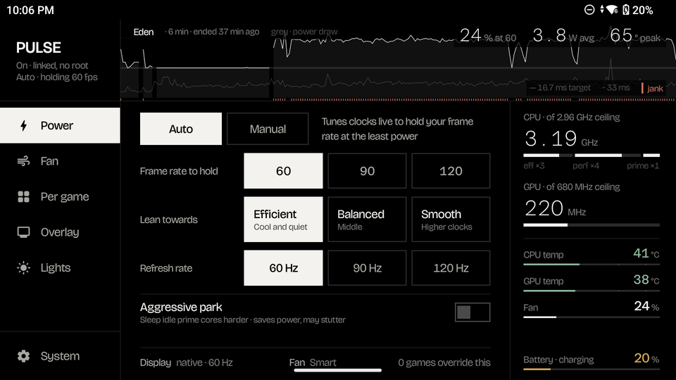

<div align="center">

# PULSE · Retroid Pocket 6 fork

*A no-root performance tuner for the Retroid Pocket 6, rebuilt around how the handheld is actually used.*




</div>

> **This is a fork.** The original **PULSE** is by [keiretrogaming](https://github.com/keiretrogaming/pulse).
> Everything that makes this app possible — the no-root PServer technique, AutoTDP, the closed-loop fan,
> the per-game engine — is their work and the work of the projects they built on. This fork is a
> redesign and a hardening pass on top of it, aimed at one device. If you have an AYN Odin 3 or Thor,
> or you want the original's five themes and broader device tuning, use upstream. Bugs in this fork are
> mine; report them here, not to upstream.

## Dedication

To **keiretrogaming**, for building PULSE in the open and disclosing honestly how it was made, and to the
chain of people before them — **AurelioB** (ClusterTune), **FeralAI** (O2P Tweaks), **TheOldTaylor**, and
the r/OdinHandheld community who first worked out how to drive these handhelds without rooting them.
None of this exists without that lineage. Full credits are in [NOTICE.md](NOTICE.md), and they stay in
every copy of this fork, as the GPL asks and as decency requires.

## What this fork changes

**Design.** One fixed screen built for the RP6's 5.5″ AMOLED in landscape, held by the grips, touch and
controller alike. True black housing (off pixels cost nothing on OLED), white ink at three levels, and
colour only where it means something — temperature, load, battery. Two typefaces: Bricolage Grotesque
for words, Azeret Mono for every live number so digits never jitter.

**Grouping.** A rail of six destinations, ordered by how often you touch them:

| Rail | What lives there |
| --- | --- |
| **Power** | Auto \| Manual. Auto is AutoTDP: frame rate to hold, lean (Efficient / Balanced / Smooth), aggressive park, refresh rate. Manual is tiers, per-cluster and GPU ceilings, power target, saved setups. |
| **Fan** | Silent / Smart / Sport / Custom, the closed-loop hold-target controller, the curve editor. Says plainly that only Custom keeps running while Auto tunes a game. |
| **Per game** | Games with their own rules, each summarised in one line. Tap to edit: Follows Power / Auto / Off · runs stock / a tier / a saved setup, plus frame rate, lean, fan, refresh. |
| **Overlay** | The in-game performance overlay (three layouts, 15 items) and the Quick Access bar. |
| **Lights** | Joystick RGB: Off / Battery / Heat / Manual with plain hue and brightness strips. |
| **System** | Master switch, **Charging**, Quick Settings tile, startup, sleep, profiles, about. |

**Session recap.** The header shows the game session that matters: live while a game runs, otherwise
the last one — name, duration, share of frames at target, average draw, peak temperature, and the whole
session's frame time over power draw as a trace. It survives the app being killed mid-game.

**Charging.** The RP6's charging separation is driven by the vendor's Settings app, and it sometimes
misses the screen-off write (after plugging in while asleep, or after low memory), leaving the battery
bypassed all night. PULSE now checks once a minute while the screen is off and re-enables charging if
needed. It never touches anything while the screen is on. The vendor's separation and 80 % limit toggles
are exposed alongside it.

**Overlays.** The performance overlay and Quick Access bar sit on a smoke surface the game reads through,
at the app's original dimensions. Quick Access is one column — brightness and volume first, then Power,
Fan, Overlay, Lights — with the bumpers jumping between groups.

## Fixes over upstream 1.19.6

These are real bugs found while working on the fork; each has a unit test and was verified on hardware.

- **Root layer.** Concurrent applies could execute each other's script (fixed-name script written outside
  the lock). Values read back from `Settings.System` were interpolated into a root shell unquoted — any app
  with `WRITE_SETTINGS` could have run commands as root through the RGB restore path. The PServer binder
  was looked up per command and its absence latched forever at boot.
- **Watcher blind after a restart.** Foreground detection read only the last 10 s of usage events, so after
  a low-memory kill mid-game the watcher came back but never re-engaged AutoTDP or the overlays until the
  next app switch. Replaced with an incremental per-activity tracker seeded from a long lookback.
- **Watcher not started on launch.** Opening the app only started the watcher when per-game rules existed;
  a force-stop left overlays, Auto and the fan dead until a toggle was flipped.
- **Wattage while plugged in.** The firmware reports `Discharging` on AC with 0 mA, so draw read as 0.1 W.
  Draw is now blanked while on external power and the live column says "charging".
- **Fan copy.** The UI claimed the fan "stays adjustable" under AutoTDP; only Custom is honoured. The
  Fan section, per-game dialog and Quick Access now say so.

The full log, with what was verified on the device, is in [PROGRESS.md](PROGRESS.md).

## Supported device

Tuned and tested on the **Retroid Pocket 6** (Snapdragon 8 Gen 2, `QCS8550`, Android 13). The AYN Odin 3
and Thor share the PServer service and should work, but nothing here has been checked on them since the
fork; upstream is the safer choice for those.

> [!WARNING]
> PULSE changes CPU and GPU frequency limits and drives the fan and charger. That affects stability,
> thermals and battery life. The kernel's thermal limiter stays in charge underneath, but you are turning
> the dials. Use it only if you understand what these controls do.

## Install

1. Download the APK from this repository's Releases.
2. Builds from this fork are signed with a different key from upstream. If upstream PULSE is installed,
   export your profiles, uninstall it, then install this one.
3. Grant **Usage access** (to know which game is in front) and **Display over other apps** (for the
   overlay) when asked. Nothing asks for root; if the device lacks the PServer service, PULSE says so.

## Build

```bash
./gradlew testDebugUnitTest lintDebug assembleDebug
```

JDK 17, Android SDK 34. The debug APK lands in `app/build/outputs/apk/debug/`. Signing for release comes
from `ANDROID_KEYSTORE_*` environment variables or `local.properties`. Contributions: see
[CONTRIBUTING.md](CONTRIBUTING.md).

## How the no-root mechanism works

The device ships a privileged `PServerBinder` service in its stock firmware. PULSE obtains it through
reflection and runs short shell scripts through it as root to write protected sysfs nodes — the same
technique ClusterTune pioneered. Every string that reaches that shell is quoted; every script is written
and executed under one lock.

## AI use during development

This fork is developed with substantial help from an AI coding assistant (Anthropic's Claude), directed and
reviewed by the maintainer. Upstream PULSE disclosed the same, and so does this fork, so you can judge the
code with that in mind.

What that means in practice:

- **The AI writes most of the code and the first draft of the words.** The maintainer decides what gets
  built, reviews every diff, and owns every commit. Nothing lands because the assistant said it works.
- **Every change is tested before it is committed.** Logic is written test-first where it can be isolated
  from Android (the charging guard, foreground tracking, the session model, the root command layer), and
  the full unit suite plus lint runs on each build. CI runs the same suite on every push.
- **Every change is validated on an actual Retroid Pocket 6.** Not an emulator, not a screenshot of a
  mockup: the app is installed on the device, the affected feature is exercised, and the result is read
  back from the hardware — sysfs nodes, `logcat`, the vendor's own settings — before the change is
  considered done. Where a fix claims to survive something (a low-memory kill, a reboot, a plug-in while
  asleep), that scenario was reproduced on the device. `PROGRESS.md` records what was verified and how.
- **Limits, stated plainly.** Only the RP6 has been used for verification since the fork. Other devices
  that share the PServer service may work but are unverified here. Bugs can still slip through; if you
  find one, the useful report is what you did, what you saw, and a `logcat` capture of the `Pulse*` tags.

## License

**GNU General Public License v2.0 or later** — see [LICENSE](LICENSE). This fork keeps the licence, the
attribution chain in [NOTICE.md](NOTICE.md) and the record of changes in [PROGRESS.md](PROGRESS.md) and
git history, as §2(a) requires. Source for every published build is this repository, tagged per release.

<div align="center">

*Built on PULSE, with thanks. If your handheld runs cooler, quieter, or longer because of it, thank
keiretrogaming first.*

</div>
